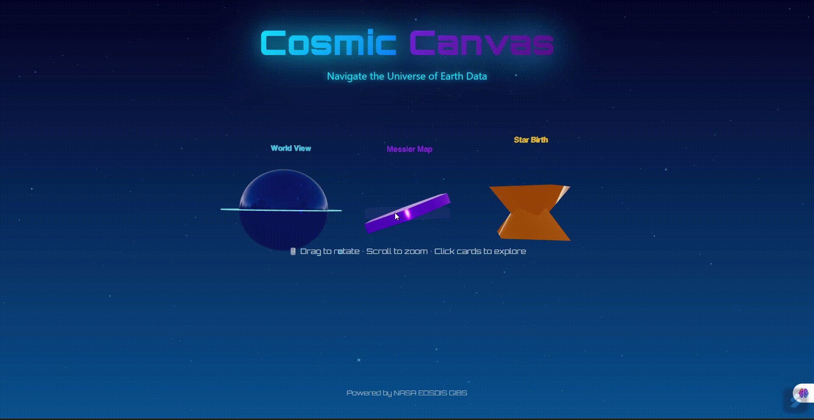
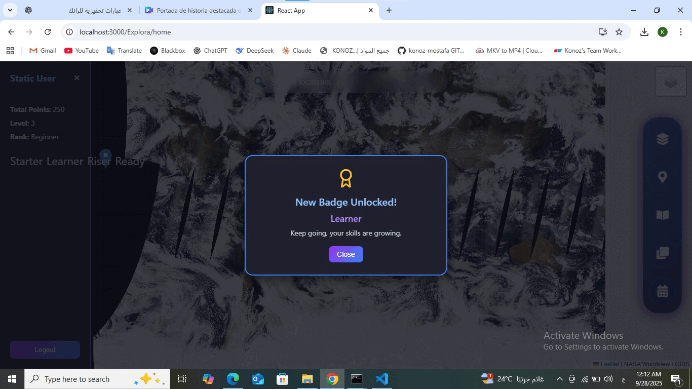

# 🚀 Cosmic Canvas - Explora NASA Educational Platform

Welcome to **Cosmic Canvas**, an interactive educational platform that brings NASA data and astronomical exploration to life! This React-based application allows users to explore Earth's climate data, discover astronomical objects, and engage with space science in an immersive way.

## 🌌 Project Overview

Cosmic Canvas is a comprehensive React application designed to educate and inspire users about:
- 🛰️ **NASA Satellite Data**: Real-time Earth observation with thermal anomalies and climate monitoring
- 🔭 **Messier Objects**: Explore famous astronomical objects like galaxies, nebulae, and globular clusters
- ⭐ **Star Birth Regions**: Discover and explore regions where stars are actively forming
- 🔬 **Hubble Telescope Images**: Deep-zoom viewer for high-resolution astronomical images
- 🎮 **Interactive Games**: Learn through engaging quizzes and challenges

### 📺 Project Introduction

Watch this comprehensive overview of the entire platform:


---

## 📸 Getting Started - Login & Access

### Before You Begin

First, see the login interface that welcomes new users to the platform:


### Login Information

Users can access the platform through two pathways:

1. **User Registration & Login**

2. **Guest Access**
   - Select your experience level (Beginner, Intermediate, Advanced)
   - Immediately start exploring without 

---

## ✨ Key Features

### 1️⃣ Welcome Experience

Beautiful, intuitive welcome screen with 3D navigation options



The welcome experience introduces users to different exploration modes and lets them choose their journey.

---

### 2️⃣ NASA World Map - Earth Observation

Full interactive map with MODIS satellite imagery and thermal anomaly detection


**Features:**
- 🗺️ Real-time MODIS satellite imagery (True Color, False Color, NDVI)
- 🔥 Thermal anomaly detection to identify wildfires and heat signatures
- ❓ Interactive quiz mode with real satellite scenes
- 📊 Educational explanations for each location


---

### 3️⃣ Messier Objects Explorer

 Interactive exploration of famous Messier catalog objects


### 4️⃣ Star Birth Regions Mapping


Interactive map where users can mark and label star-forming regions


**Capabilities:**
- 📍 Click on the map to mark star formation regions
- 🏷️ Add custom labels and descriptions
- 💾 Save your discoveries to personal profile
- 🔍 Explore regions highlighted by astronomers

---

## 🛠️ Tech Stack

This project is built with modern, industry-standard technologies:

```json
{
  "Frontend Framework": "React 19.1.0",
  "Routing": "React Router DOM 7.9.1",
  "Mapping": "React Leaflet 5.0.0 + Leaflet 1.9.4",
  "3D Graphics": "Three.js 0.180.0 + React Three Fiber 9.3.0",
  "Icons": "React Icons 5.5.0",
  "Image Viewer": "OpenSeadragon 5.0.1",
  "HTTP Client": "Axios 1.12.2",
  "Build Tool": "React Scripts 5.0.1"
}
```


## 📁 Project Structure

```
frontend/
├── src/
│   ├── components/
│   │   ├── NasaWorldMap.jsx          # Main NASA satellite map
│   │   ├── WorldMap.jsx              # Map configuration
│   │   ├── Chatbot.jsx               # AI assistant
│   │   ├── SearchComponent.jsx       # Location search
│   │   ├── CustomZoom.jsx            # Zoom controls
│   │   ├── DynamicSidebar.jsx        # Context menu
│   │   ├── layers.jsx                # Map layers configuration
│   │   └── mapConfigs.js             # Map settings
│   │
│   ├── pages/
│   │   ├── auth/
│   │   │   └── RegistrationLogin.jsx # Login & registration
│   │   ├── welcome/
│   │   │   └── WelcomePage.jsx       # Welcome screen
│   │   ├── home/
│   │   │   └── Home.jsx              # Home dashboard
│   │   ├── Game/
│   │   │   └── Game.jsx              # Quiz & challenges
│   │   ├── Messier/
│   │   │   ├── MessierGame.jsx       # Messier quiz
│   │   │   └── MessierMap.jsx        # Messier map viewer
│   │   ├── Hubble/
│   │   │   ├── HubbleViewer.jsx      # Deep zoom viewer
│   │   │   └── ImageSelection.jsx    # Image selector
│   │   └── StarBirth/
│   │       └── StarBirthMap.jsx      # Star formation regions
│   │
│   ├── App.js                        # Main app router
│   └── index.js                      # React entry point
│
├── public/
│   ├── index.html
│   └── fonts/                        # 3D fonts for visualization
│
└── package.json
```

---
---

## 🎮 Interactive Learning Experiences

### NASA World Map Game Mode
- Answer questions about satellite imagery
- Score points for correct identifications
- Learn about Earth's climate and geography
- Real data from NASA satellites


---
## 👤 User Profile & Achievement Badges

Track your progress and unlock achievements as you explore the cosmos!

### Player Profile Features
- 📊 **Progress Tracking**: Monitor your learning journey across different modules
- 🏆 **Achievement System**: Earn badges based on your accomplishments
- 📈 **Statistics**: View completion rates and quiz scores
- 🎖️ **Badge Collection**: Display earned badges on your profile


### Badges

Unlock badges by completing challenges and quizzes! Here are 7 of the top achievements you can earn:

- **Starter** - Begin your cosmic journey
- **Learner** - Complete your first exploration module
- **Beginner** - Master basic concepts
- **Intermediate** - Progress to intermediate challenges
- **Advanced** - Reach advanced difficulty levels
- **Expert** - Become a cosmic expert
- **Master** - Conquer the deepest secrets of the universe

*(You can see the complete collection of badge in the `src/pages/profile/badges` directory.)*

---

## 🎨 User Interface Highlights

✅ **Responsive Design** - Works on desktop, tablet, and mobile
✅ **Dark Theme** - Comfortable viewing for astronomy content
✅ **Smooth Animations** - Engaging transitions and interactions
✅ **Intuitive Navigation** - Easy-to-use sidebar and menus
✅ **Accessibility** - Keyboard navigation support

---

## 📖 Learning Resources

- [NASA Earth Observatory](https://earthobservatory.nasa.gov/)
- [Messier Catalog Information](https://en.wikipedia.org/wiki/Messier_object)
- [React Documentation](https://react.dev/)
- [Leaflet Maps Documentation](https://leafletjs.com/)


## 🌟 Explore The Full Project (interact with Backend)

Want to see the full project in action? Visit the complete GitHub repository:

📱 **GitHub Project**: [Cosmic Canvas - Embiggen Your Eyes](https://github.com/Cosmic-canvas-Embiggen-you-eyes)

Explore the universe, expand your knowledge, and discover the cosmos from your browser! 🌍🔭✨
